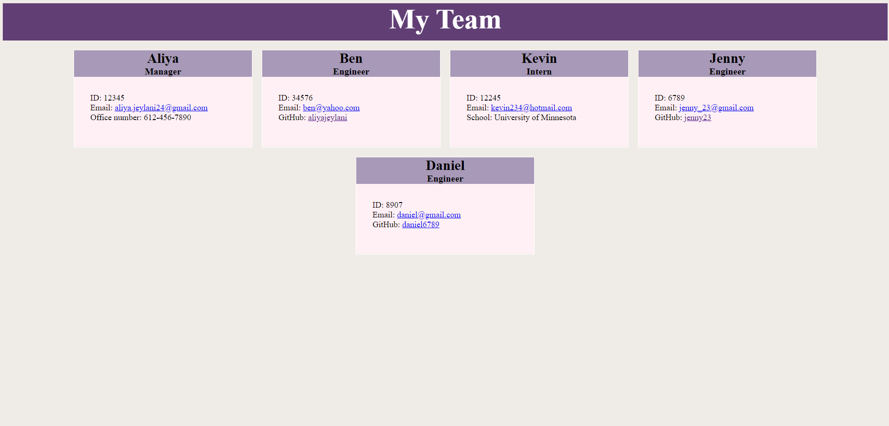

# Team Profile Generator

# Description
  This week's project is to use node inquirer in order to run a command line application that accepts user inputs to display information about employees on a software engineering team. My application will prompt the user for information about his team (name, id, email, etc.) to generate a team profile webpage. 

  Here's my sample HTML file that I generated: https://github.com/aliyajeylani/team_profile_generator/blob/main/dist/index.html

  Here's a demo link that demonstrates the functionality of the application: https://drive.google.com/file/d/1c_6ipJ8W3_3FVSShYrbeHjrQTMELGq8k/view?usp=sharing

  Image of team webpage:

  

  ### Installation

  To complete this project, I needed to install node.js on my computer to run code in the command line. I also needed to have a package.json and inquirer package installed to make my application work. In order to test my test scripts, i had to install jest to check if my test scripts have passed. 

  ### Usage

  Here is the link to my gitHub repository: https://github.com/aliyajeylani/team_profile_generator

  ### Credits
  
  N/A

  ### License

  N/A

 